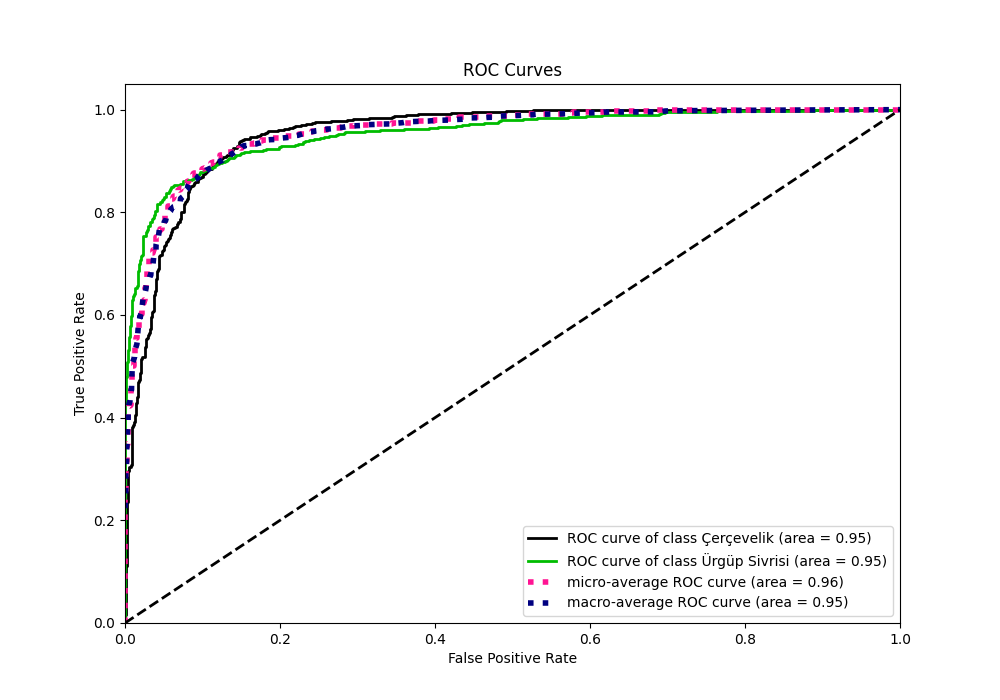
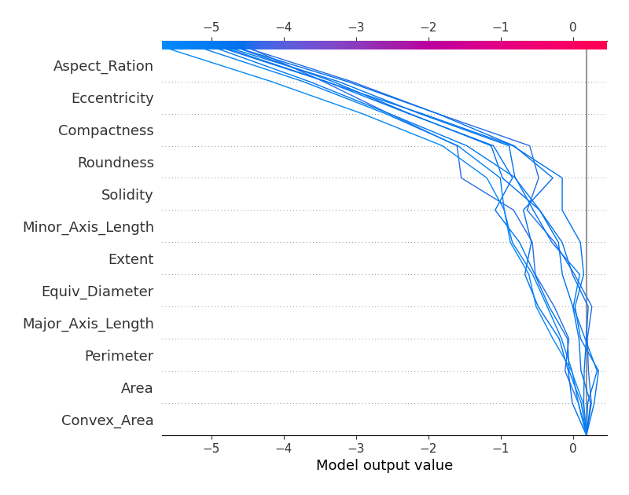
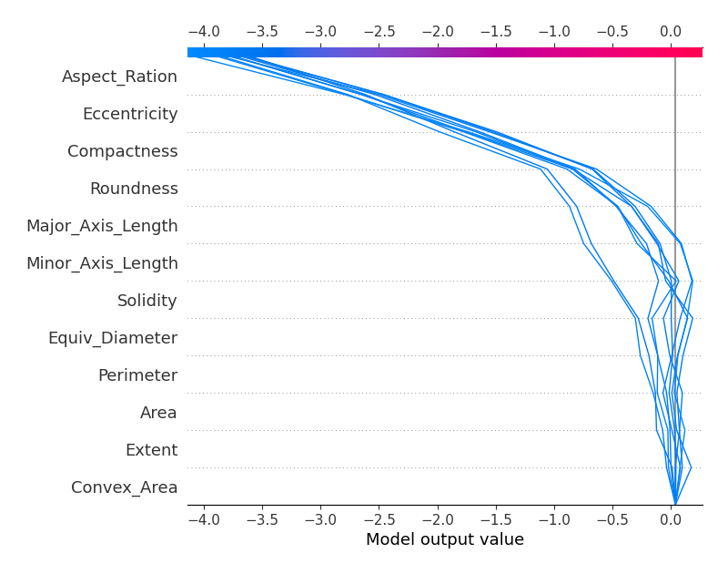

# Summary of 1_Optuna_LightGBM

[<< Go back](../README.md)

## LightGBM
- **n_jobs**: -1
- **objective**: binary
- **num_leaves**: 1553
- **learning_rate**: 0.1
- **feature_fraction**: 0.6372942274996019
- **bagging_fraction**: 0.649963737714838
- **min_data_in_leaf**: 2
- **metric**: binary_logloss
- **custom_eval_metric_name**: None
- **lambda_l1**: 0.00015613577890072756
- **lambda_l2**: 0.005003670155001035
- **bagging_freq**: 5
- **extra_trees**: True
- **num_boost_round**: 1000
- **early_stopping_rounds**: 50
- **cat_feature**: []
- **feature_pre_filter**: False
- **explain_level**: 2

## Validation
 - **validation_type**: kfold
 - **k_folds**: 10
 - **shuffle**: True
 - **stratify**: True

## Optimized metric
logloss

## Training time

18.8 seconds

## Metric details
|           |    score |    threshold |
|:----------|---------:|-------------:|
| logloss   | 0.267532 | nan          |
| auc       | 0.953404 | nan          |
| f1        | 0.885605 |   0.543914   |
| accuracy  | 0.8955   |   0.543914   |
| precision | 1        |   0.982488   |
| recall    | 1        |   0.00240858 |
| mcc       | 0.791587 |   0.543914   |

## Metric details with threshold from accuracy metric
|           |    score |   threshold |
|:----------|---------:|------------:|
| logloss   | 0.267532 |  nan        |
| auc       | 0.953404 |  nan        |
| f1        | 0.885605 |    0.543914 |
| accuracy  | 0.8955   |    0.543914 |
| precision | 0.920364 |    0.543914 |
| recall    | 0.853376 |    0.543914 |
| mcc       | 0.791587 |    0.543914 |

## Confusion matrix (at threshold=0.543914)
|                          |   Predicted as Çerçevelik |   Predicted as Ürgüp Sivrisi |
|:-------------------------|--------------------------:|-----------------------------:|
| Labeled as Çerçevelik    |                       982 |                           70 |
| Labeled as Ürgüp Sivrisi |                       139 |                          809 |

## Learning curves

## Permutation-based Importance

## Confusion Matrix

## Normalized Confusion Matrix

## ROC Curve

## Kolmogorov-Smirnov Statistic

## Precision-Recall Curve

## Calibration Curve

## Cumulative Gains Curve

## Lift Curve

## SHAP Importance

## SHAP Dependence plots

### Dependence (Fold 1)

### Dependence (Fold 2)

### Dependence (Fold 3)

### Dependence (Fold 4)

### Dependence (Fold 5)

### Dependence (Fold 6)

### Dependence (Fold 7)

### Dependence (Fold 8)

### Dependence (Fold 9)

### Dependence (Fold 10)

## SHAP Decision plots

### Top-10 Worst decisions for class 0 (Fold 1)

### Top-10 Worst decisions for class 0 (Fold 2)

### Top-10 Worst decisions for class 0 (Fold 3)

### Top-10 Worst decisions for class 0 (Fold 4)

### Top-10 Worst decisions for class 0 (Fold 5)

### Top-10 Worst decisions for class 0 (Fold 6)

### Top-10 Worst decisions for class 0 (Fold 7)

### Top-10 Worst decisions for class 0 (Fold 8)

### Top-10 Worst decisions for class 0 (Fold 9)

### Top-10 Worst decisions for class 0 (Fold 10)

### Top-10 Best decisions for class 0 (Fold 1)

### Top-10 Best decisions for class 0 (Fold 2)

### Top-10 Best decisions for class 0 (Fold 3)

### Top-10 Best decisions for class 0 (Fold 4)

### Top-10 Best decisions for class 0 (Fold 5)

### Top-10 Best decisions for class 0 (Fold 6)

### Top-10 Best decisions for class 0 (Fold 7)

### Top-10 Best decisions for class 0 (Fold 8)

### Top-10 Best decisions for class 0 (Fold 9)

### Top-10 Best decisions for class 0 (Fold 10)

### Top-10 Worst decisions for class 1 (Fold 1)

### Top-10 Worst decisions for class 1 (Fold 2)

### Top-10 Worst decisions for class 1 (Fold 3)

### Top-10 Worst decisions for class 1 (Fold 4)

### Top-10 Worst decisions for class 1 (Fold 5)

### Top-10 Worst decisions for class 1 (Fold 6)

### Top-10 Worst decisions for class 1 (Fold 7)

### Top-10 Worst decisions for class 1 (Fold 8)

### Top-10 Worst decisions for class 1 (Fold 9)

### Top-10 Worst decisions for class 1 (Fold 10)

### Top-10 Best decisions for class 1 (Fold 1)

### Top-10 Best decisions for class 1 (Fold 2)

### Top-10 Best decisions for class 1 (Fold 3)

### Top-10 Best decisions for class 1 (Fold 4)

### Top-10 Best decisions for class 1 (Fold 5)

### Top-10 Best decisions for class 1 (Fold 6)

### Top-10 Best decisions for class 1 (Fold 7)

### Top-10 Best decisions for class 1 (Fold 8)

### Top-10 Best decisions for class 1 (Fold 9)

### Top-10 Best decisions for class 1 (Fold 10)

[<< Go back](../README.md)
