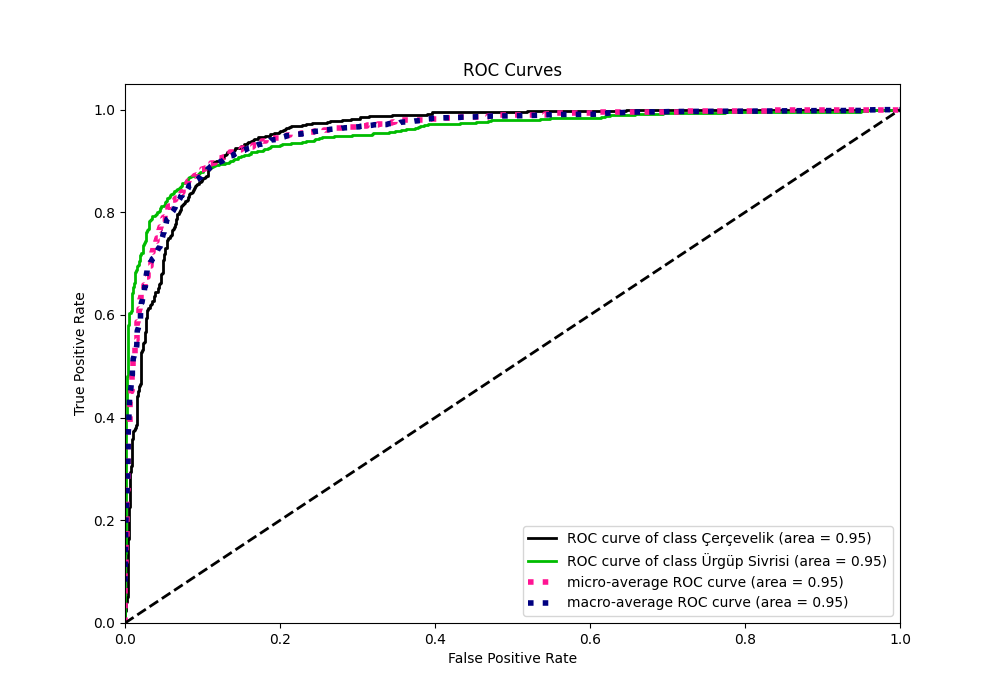
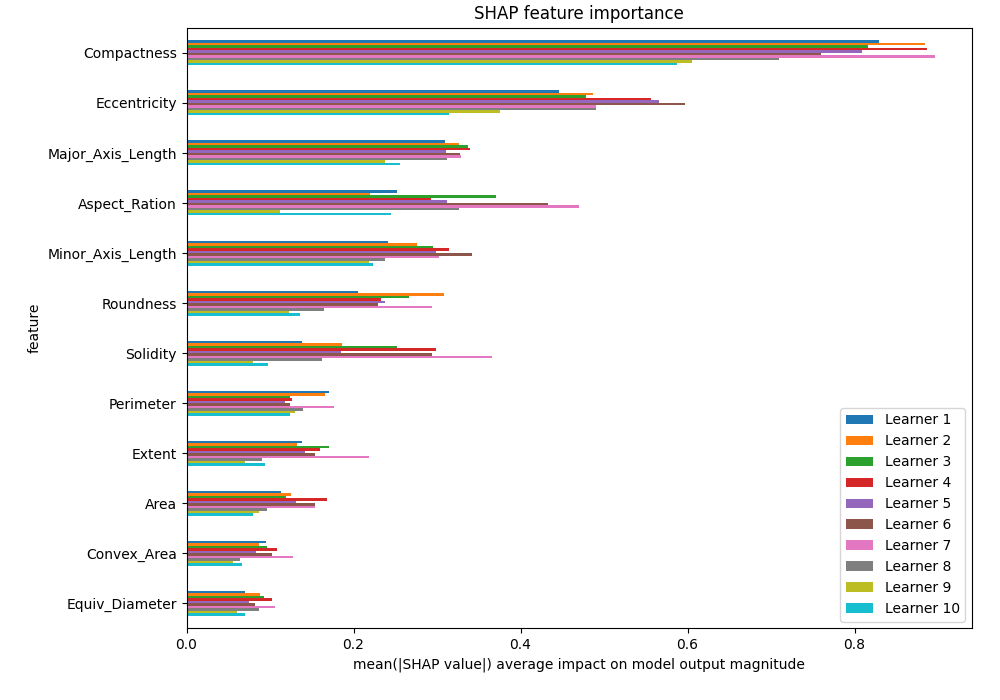
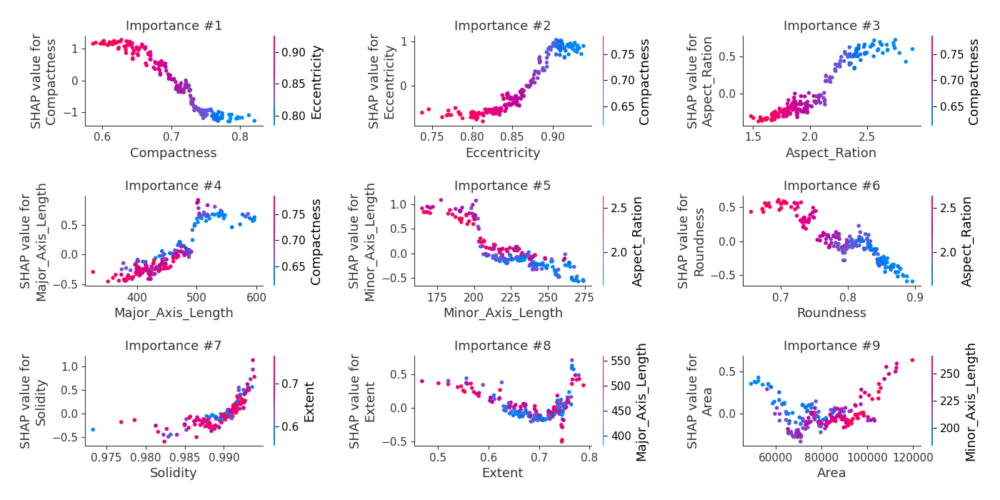
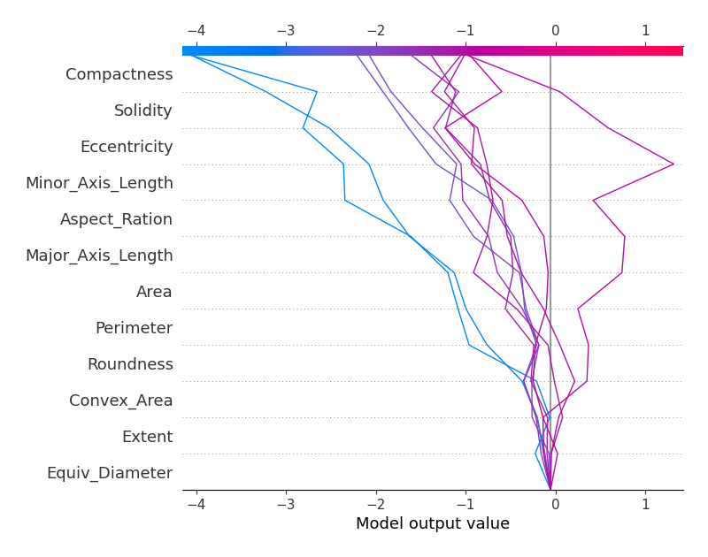
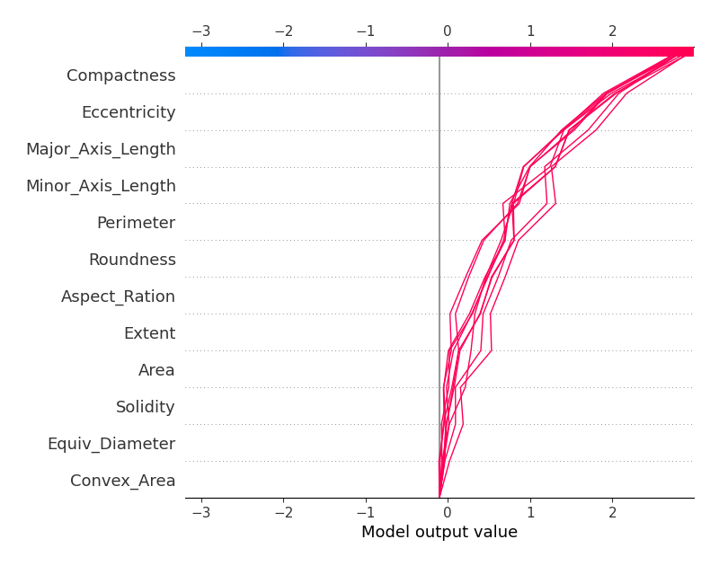

# Summary of 2_Optuna_Xgboost

[<< Go back](../README.md)

## Extreme Gradient Boosting (Xgboost)
- **n_jobs**: -1
- **objective**: binary:logistic
- **eta**: 0.05
- **max_depth**: 5
- **min_child_weight**: 1
- **subsample**: 0.5758258292131195
- **colsample_bytree**: 0.3228568309919116
- **eval_metric**: logloss
- **lambda**: 1.4668648312244355e-06
- **alpha**: 8.22322663436197e-07
- **max_rounds**: 1000
- **early_stopping_rounds**: 50
- **explain_level**: 2

## Validation
 - **validation_type**: kfold
 - **k_folds**: 10
 - **shuffle**: True
 - **stratify**: True

## Optimized metric
logloss

## Training time

16.4 seconds

## Metric details
|           |    score |    threshold |
|:----------|---------:|-------------:|
| logloss   | 0.271852 | nan          |
| auc       | 0.952193 | nan          |
| f1        | 0.884842 |   0.442869   |
| accuracy  | 0.8925   |   0.442869   |
| precision | 1        |   0.991096   |
| recall    | 1        |   0.00262342 |
| mcc       | 0.784423 |   0.442869   |

## Metric details with threshold from accuracy metric
|           |    score |   threshold |
|:----------|---------:|------------:|
| logloss   | 0.271852 |  nan        |
| auc       | 0.952193 |  nan        |
| f1        | 0.884842 |    0.442869 |
| accuracy  | 0.8925   |    0.442869 |
| precision | 0.898803 |    0.442869 |
| recall    | 0.871308 |    0.442869 |
| mcc       | 0.784423 |    0.442869 |

## Confusion matrix (at threshold=0.442869)
|                          |   Predicted as Çerçevelik |   Predicted as Ürgüp Sivrisi |
|:-------------------------|--------------------------:|-----------------------------:|
| Labeled as Çerçevelik    |                       959 |                           93 |
| Labeled as Ürgüp Sivrisi |                       122 |                          826 |

## Learning curves

## Permutation-based Importance

## Confusion Matrix

## Normalized Confusion Matrix

## ROC Curve

## Kolmogorov-Smirnov Statistic

## Precision-Recall Curve

## Calibration Curve

## Cumulative Gains Curve

## Lift Curve

## SHAP Importance

## SHAP Dependence plots

### Dependence (Fold 1)

### Dependence (Fold 2)

### Dependence (Fold 3)

### Dependence (Fold 4)

### Dependence (Fold 5)

### Dependence (Fold 6)

### Dependence (Fold 7)

### Dependence (Fold 8)

### Dependence (Fold 9)

### Dependence (Fold 10)

## SHAP Decision plots

### Top-10 Worst decisions for class 0 (Fold 1)

### Top-10 Worst decisions for class 0 (Fold 2)

### Top-10 Worst decisions for class 0 (Fold 3)

### Top-10 Worst decisions for class 0 (Fold 4)

### Top-10 Worst decisions for class 0 (Fold 5)

### Top-10 Worst decisions for class 0 (Fold 6)

### Top-10 Worst decisions for class 0 (Fold 7)

### Top-10 Worst decisions for class 0 (Fold 8)

### Top-10 Worst decisions for class 0 (Fold 9)

### Top-10 Worst decisions for class 0 (Fold 10)

### Top-10 Best decisions for class 0 (Fold 1)

### Top-10 Best decisions for class 0 (Fold 2)

### Top-10 Best decisions for class 0 (Fold 3)

### Top-10 Best decisions for class 0 (Fold 4)

### Top-10 Best decisions for class 0 (Fold 5)

### Top-10 Best decisions for class 0 (Fold 6)

### Top-10 Best decisions for class 0 (Fold 7)

### Top-10 Best decisions for class 0 (Fold 8)

### Top-10 Best decisions for class 0 (Fold 9)

### Top-10 Best decisions for class 0 (Fold 10)

### Top-10 Worst decisions for class 1 (Fold 1)

### Top-10 Worst decisions for class 1 (Fold 2)

### Top-10 Worst decisions for class 1 (Fold 3)

### Top-10 Worst decisions for class 1 (Fold 4)

### Top-10 Worst decisions for class 1 (Fold 5)

### Top-10 Worst decisions for class 1 (Fold 6)

### Top-10 Worst decisions for class 1 (Fold 7)

### Top-10 Worst decisions for class 1 (Fold 8)

### Top-10 Worst decisions for class 1 (Fold 9)

### Top-10 Worst decisions for class 1 (Fold 10)

### Top-10 Best decisions for class 1 (Fold 1)

### Top-10 Best decisions for class 1 (Fold 2)

### Top-10 Best decisions for class 1 (Fold 3)

### Top-10 Best decisions for class 1 (Fold 4)

### Top-10 Best decisions for class 1 (Fold 5)

### Top-10 Best decisions for class 1 (Fold 6)

### Top-10 Best decisions for class 1 (Fold 7)

### Top-10 Best decisions for class 1 (Fold 8)

### Top-10 Best decisions for class 1 (Fold 9)

### Top-10 Best decisions for class 1 (Fold 10)

[<< Go back](../README.md)
