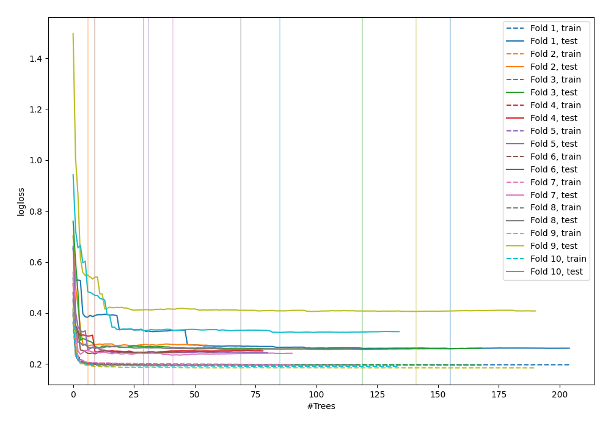
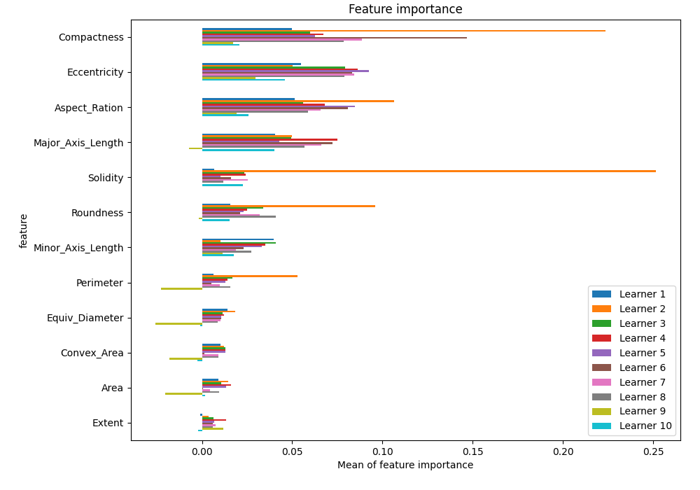
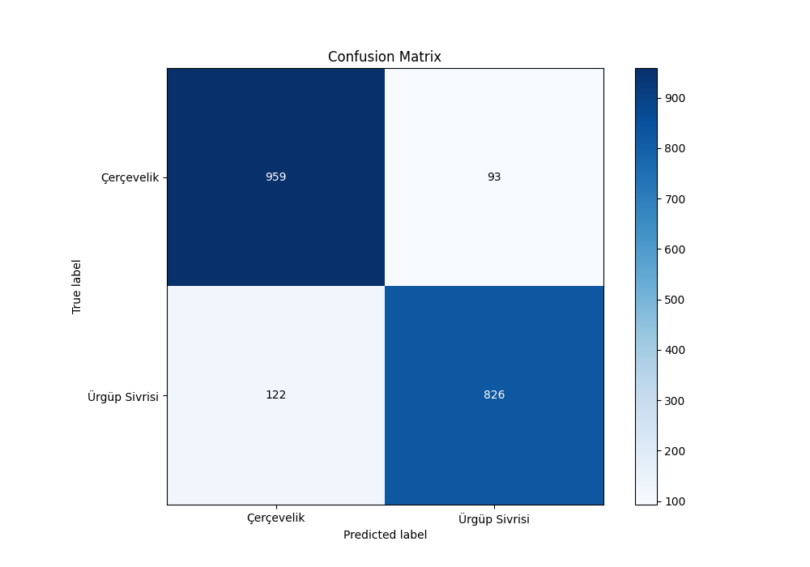
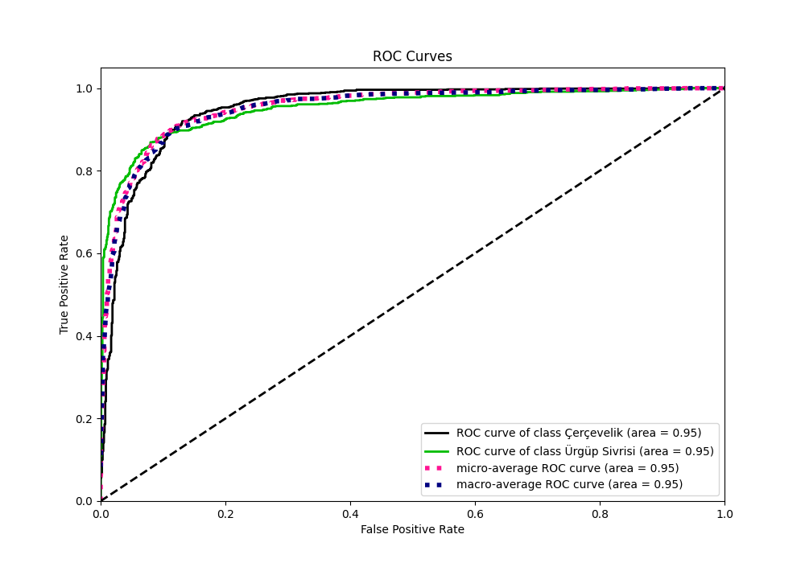
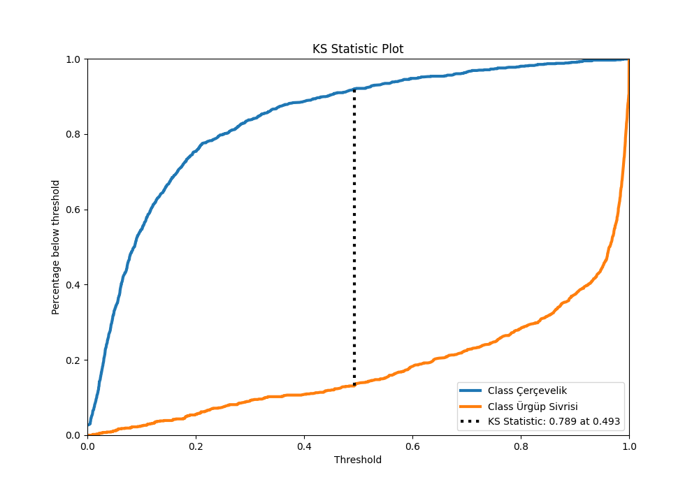
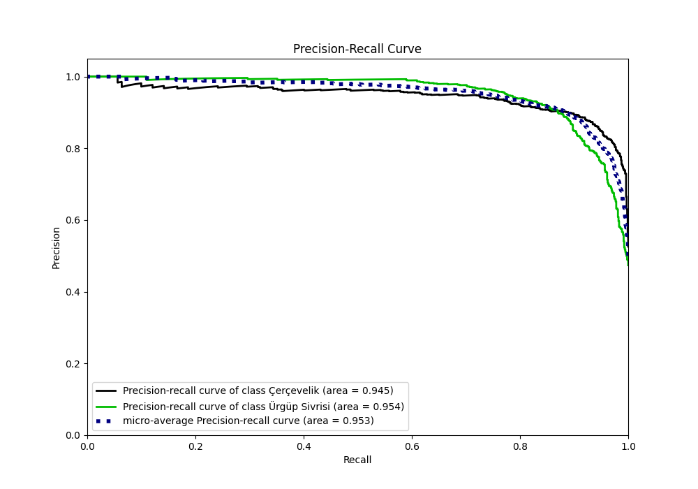
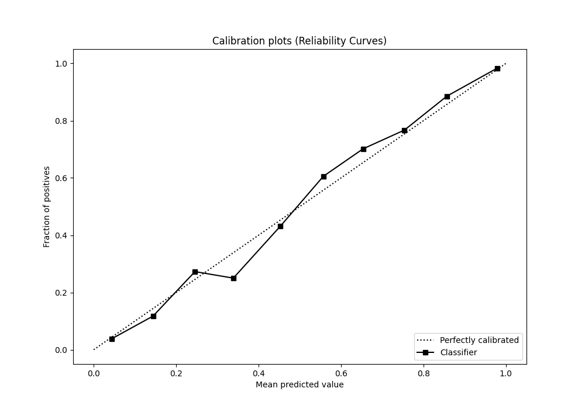
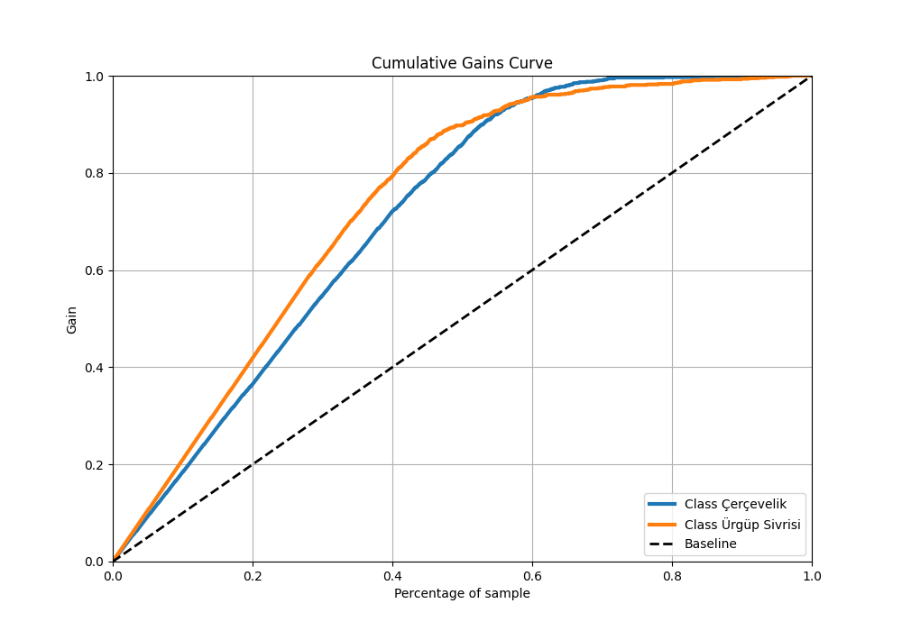
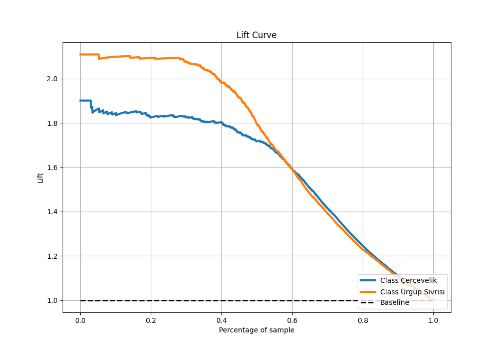

# Summary of 3_Optuna_RandomForest

[<< Go back](../README.md)

## Random Forest
- **n_jobs**: -1
- **criterion**: entropy
- **max_features**: 0.036068463600684
- **min_samples_split**: 19
- **max_depth**: 28
- **eval_metric_name**: logloss
- **min_samples_leaf**: 6
- **max_steps**: 10
- **explain_level**: 2

## Validation
 - **validation_type**: kfold
 - **k_folds**: 10
 - **shuffle**: True
 - **stratify**: True

## Optimized metric
logloss

## Training time

16.7 seconds

## Metric details
|           |    score |   threshold |
|:----------|---------:|------------:|
| logloss   | 0.273661 |  nan        |
| auc       | 0.95145  |  nan        |
| f1        | 0.885003 |    0.445593 |
| accuracy  | 0.8925   |    0.476828 |
| precision | 1        |    0.998986 |
| recall    | 1        |    0        |
| mcc       | 0.785535 |    0.541451 |

## Metric details with threshold from accuracy metric
|           |    score |   threshold |
|:----------|---------:|------------:|
| logloss   | 0.273661 |  nan        |
| auc       | 0.95145  |  nan        |
| f1        | 0.884842 |    0.476828 |
| accuracy  | 0.8925   |    0.476828 |
| precision | 0.898803 |    0.476828 |
| recall    | 0.871308 |    0.476828 |
| mcc       | 0.784423 |    0.476828 |

## Confusion matrix (at threshold=0.476828)
|                          |   Predicted as Çerçevelik |   Predicted as Ürgüp Sivrisi |
|:-------------------------|--------------------------:|-----------------------------:|
| Labeled as Çerçevelik    |                       959 |                           93 |
| Labeled as Ürgüp Sivrisi |                       122 |                          826 |

## Learning curves

## Permutation-based Importance

## Confusion Matrix

## Normalized Confusion Matrix

## ROC Curve

## Kolmogorov-Smirnov Statistic

## Precision-Recall Curve

## Calibration Curve

## Cumulative Gains Curve

## Lift Curve

[<< Go back](../README.md)
