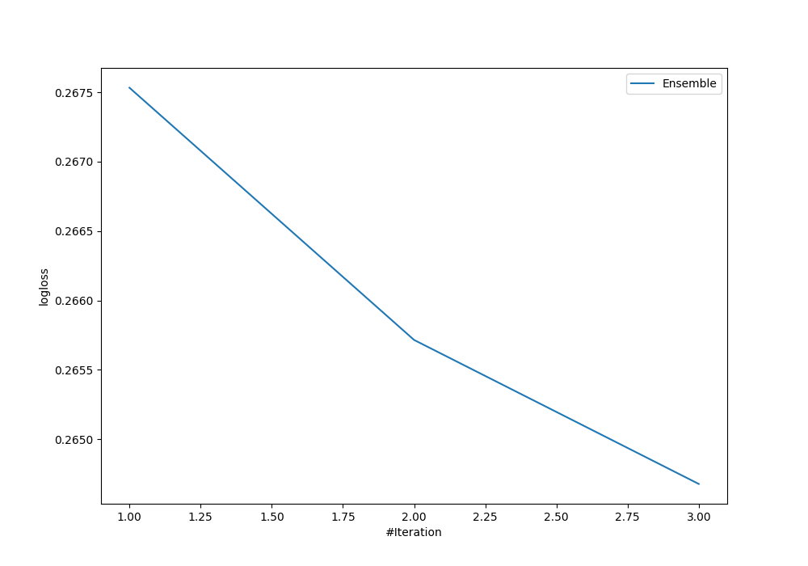
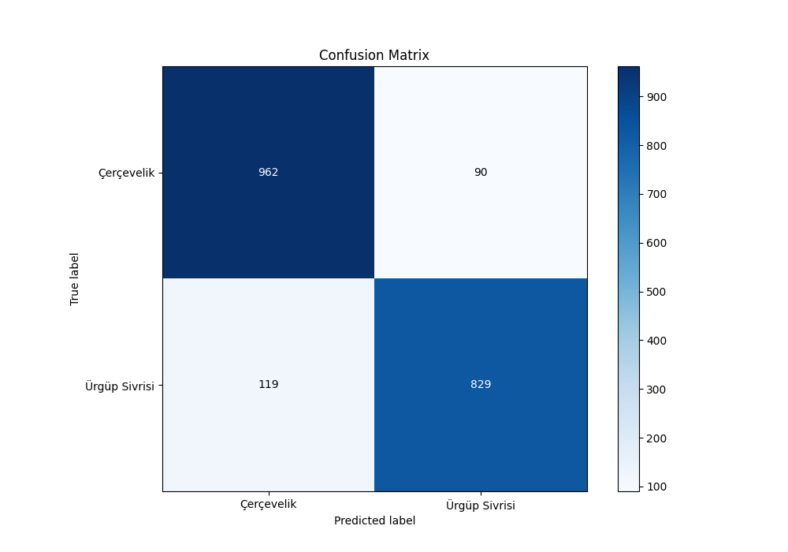
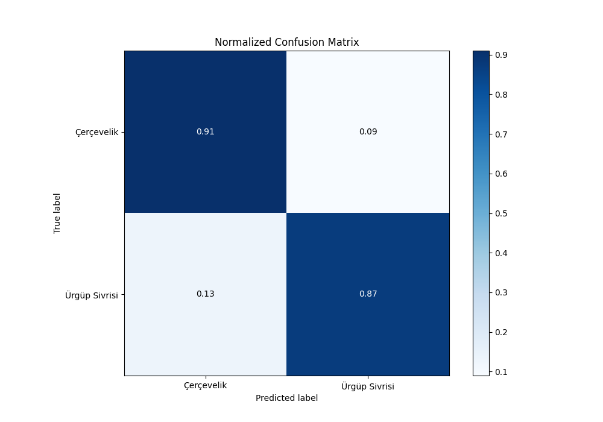
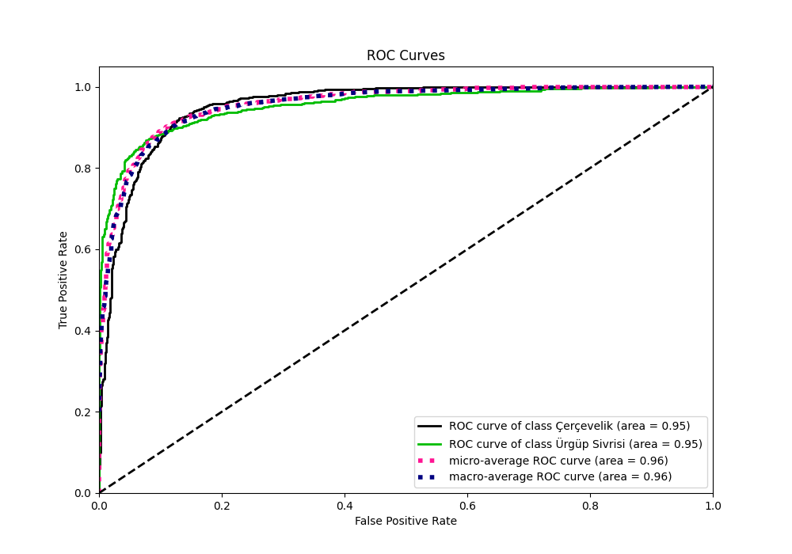
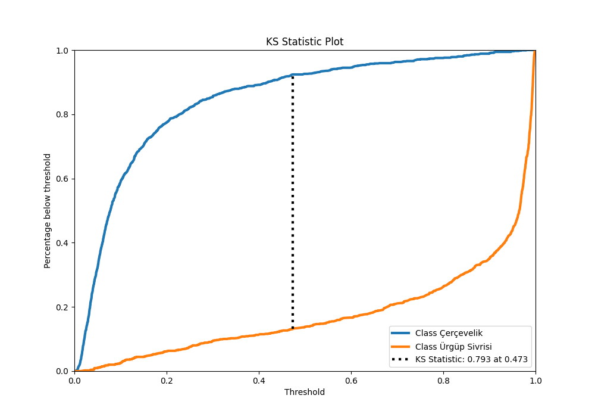
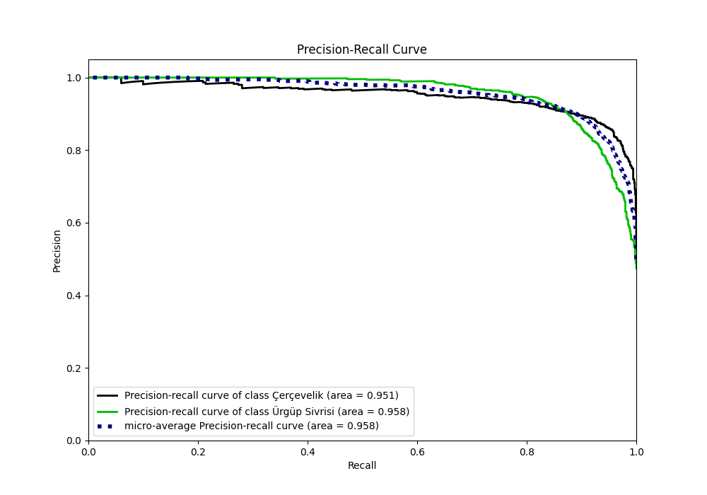
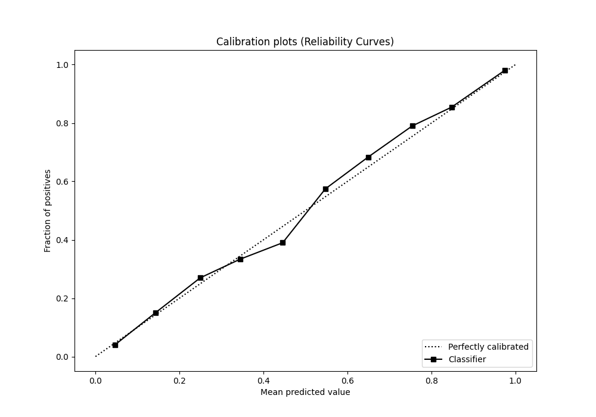
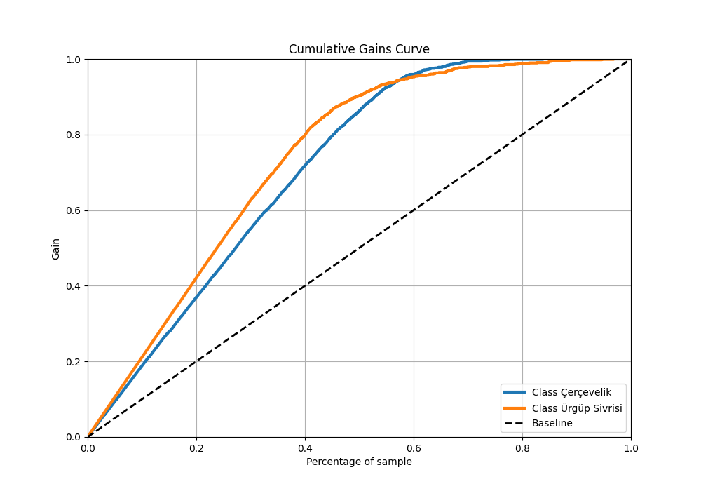
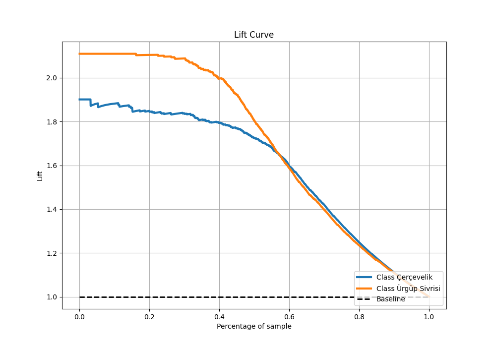

# Summary of Ensemble

[<< Go back](../README.md)

## Ensemble structure
| Model                 |   Weight |
|:----------------------|---------:|
| 1_Optuna_LightGBM     |        1 |
| 2_Optuna_Xgboost      |        1 |
| 3_Optuna_RandomForest |        1 |

## Metric details
|           |    score |    threshold |
|:----------|---------:|-------------:|
| logloss   | 0.264678 | nan          |
| auc       | 0.954611 | nan          |
| f1        | 0.888056 |   0.45137    |
| accuracy  | 0.8955   |   0.45137    |
| precision | 1        |   0.980023   |
| recall    | 1        |   0.00364726 |
| mcc       | 0.790857 |   0.495641   |

## Metric details with threshold from accuracy metric
|           |    score |   threshold |
|:----------|---------:|------------:|
| logloss   | 0.264678 |   nan       |
| auc       | 0.954611 |   nan       |
| f1        | 0.888056 |     0.45137 |
| accuracy  | 0.8955   |     0.45137 |
| precision | 0.902067 |     0.45137 |
| recall    | 0.874473 |     0.45137 |
| mcc       | 0.790451 |     0.45137 |

## Confusion matrix (at threshold=0.45137)
|                          |   Predicted as Çerçevelik |   Predicted as Ürgüp Sivrisi |
|:-------------------------|--------------------------:|-----------------------------:|
| Labeled as Çerçevelik    |                       962 |                           90 |
| Labeled as Ürgüp Sivrisi |                       119 |                          829 |

## Learning curves

## Confusion Matrix

## Normalized Confusion Matrix

## ROC Curve

## Kolmogorov-Smirnov Statistic

## Precision-Recall Curve

## Calibration Curve

## Cumulative Gains Curve

## Lift Curve

[<< Go back](../README.md)
