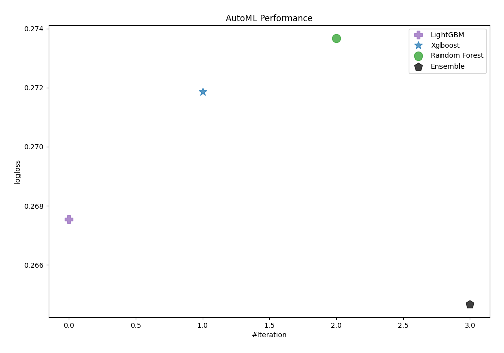
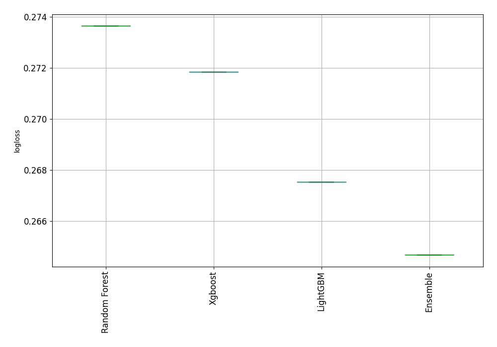
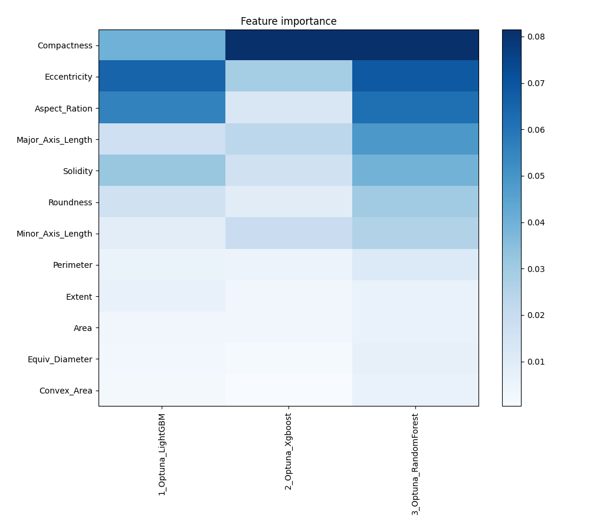
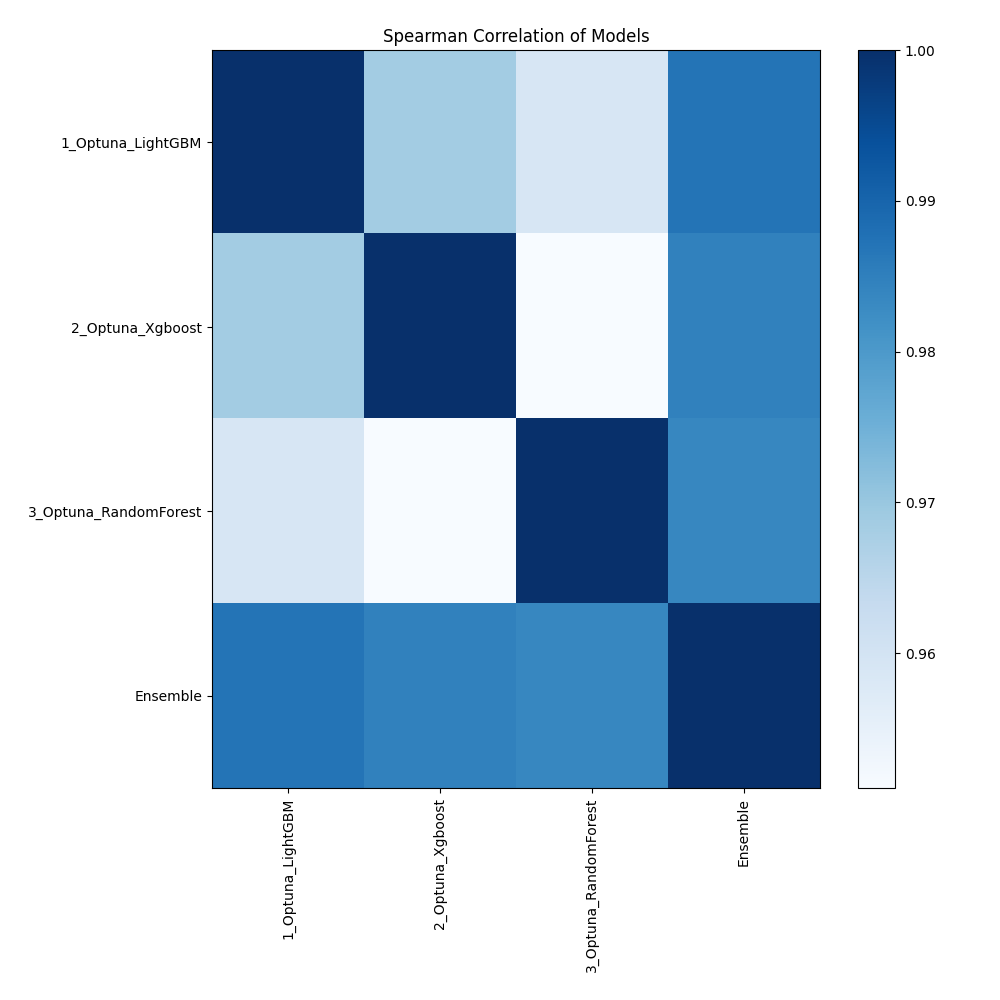

# AutoML Leaderboard

| Best model   | name                                                     | model_type    | metric_type   |   metric_value |   train_time |
|:-------------|:---------------------------------------------------------|:--------------|:--------------|---------------:|-------------:|
|              | [1_Optuna_LightGBM](1_Optuna_LightGBM/README.md)         | LightGBM      | logloss       |       0.267532 |        19.48 |
|              | [2_Optuna_Xgboost](2_Optuna_Xgboost/README.md)           | Xgboost       | logloss       |       0.271852 |        17.06 |
|              | [3_Optuna_RandomForest](3_Optuna_RandomForest/README.md) | Random Forest | logloss       |       0.273661 |        17.25 |
| **the best** | [Ensemble](Ensemble/README.md)                           | Ensemble      | logloss       |       0.264678 |         0.91 |

### AutoML Performance

### AutoML Performance Boxplot

### Features Importance

### Spearman Correlation of Models

