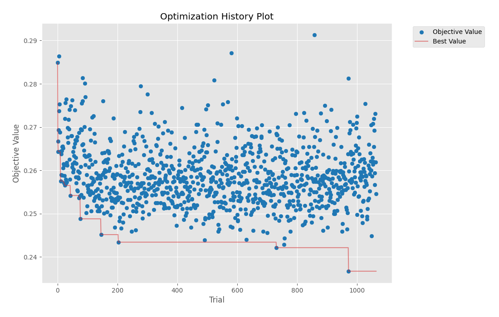
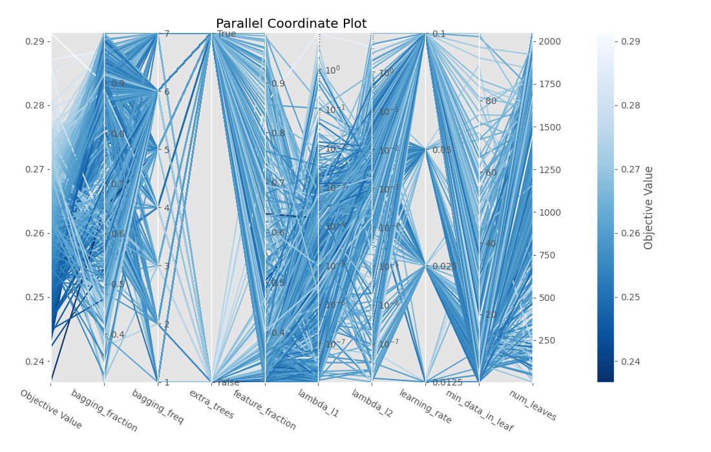
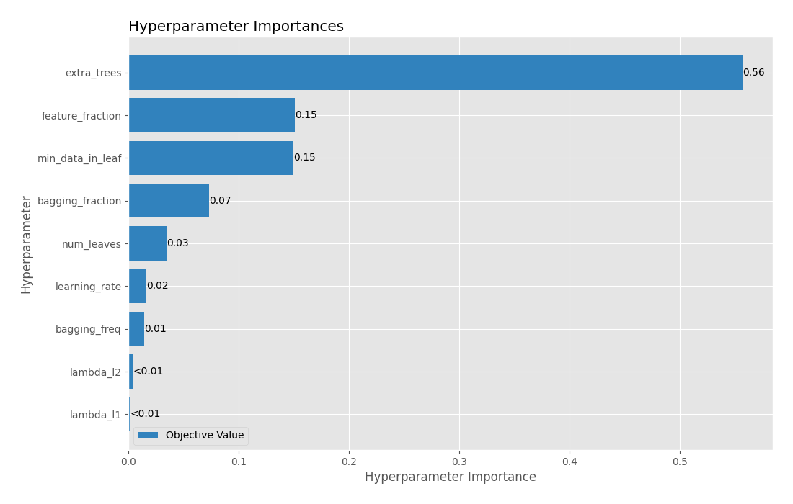
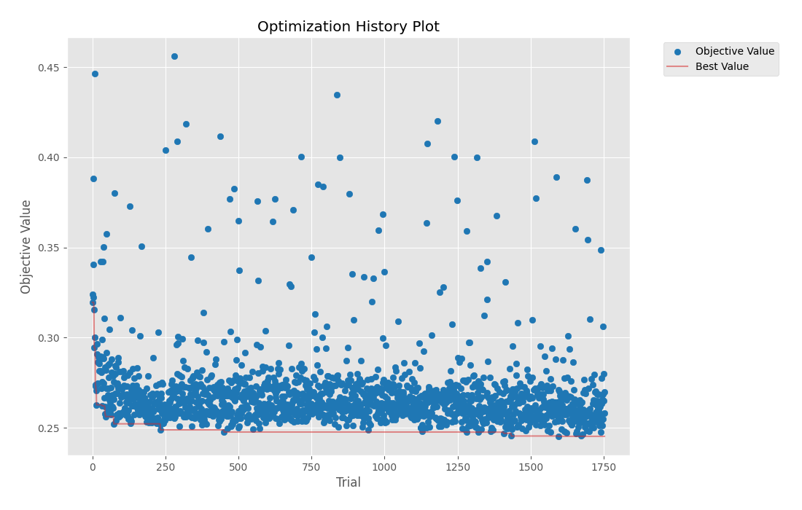
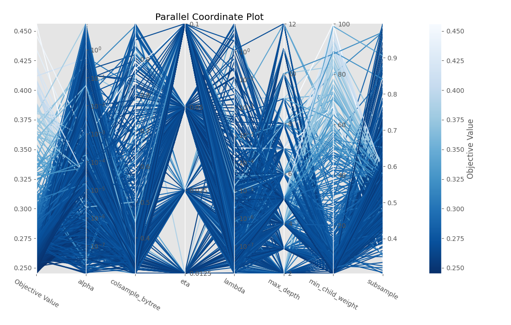
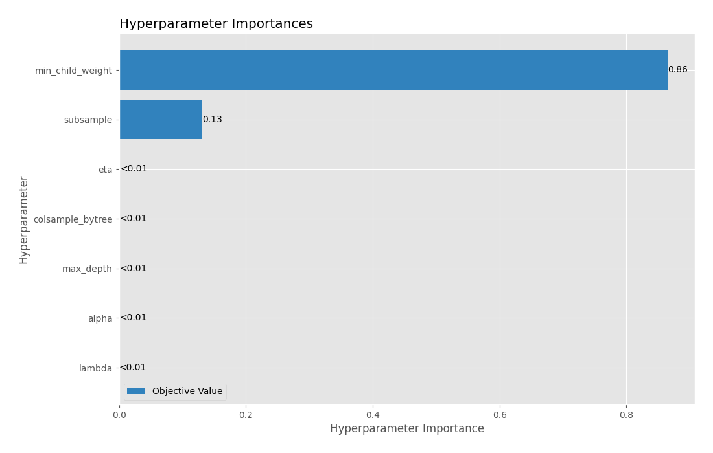
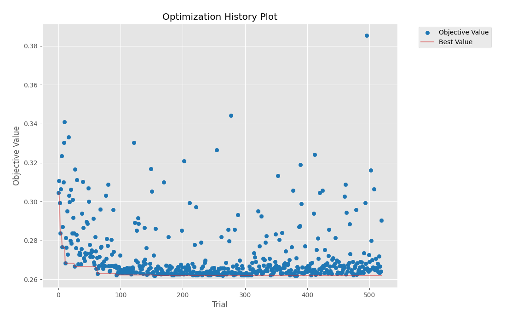
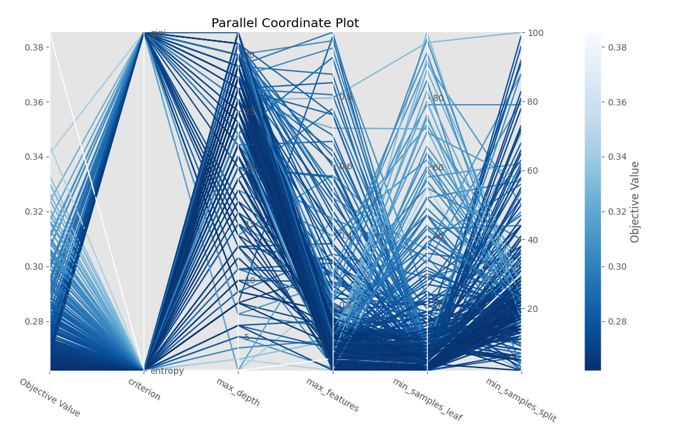
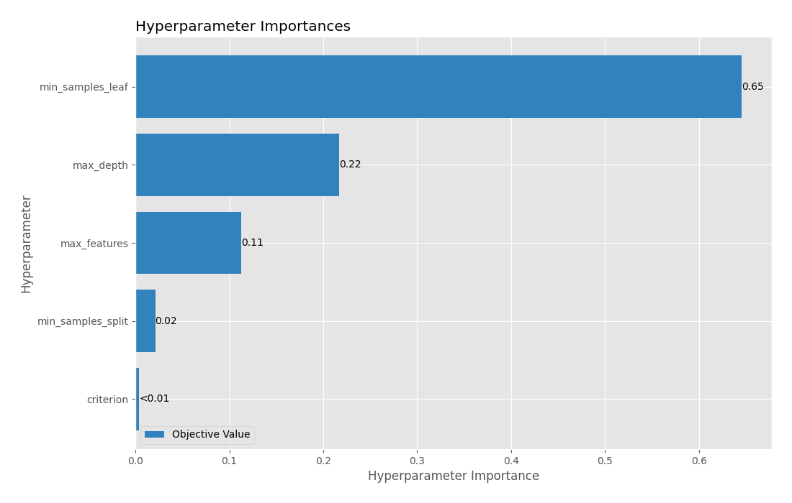

# Optuna tuning for LightGBM on original data

## LightGBM Optimization History

## LightGBM Parallel Coordinate

## LightGBM Param Importances

[<< Go back](../README.md)
# Optuna tuning for Xgboost on original data

## Xgboost Optimization History

## Xgboost Parallel Coordinate

## Xgboost Param Importances

[<< Go back](../README.md)
# Optuna tuning for Random Forest on original data

## Random Forest Optimization History

## Random Forest Parallel Coordinate

## Random Forest Param Importances

[<< Go back](../README.md)
